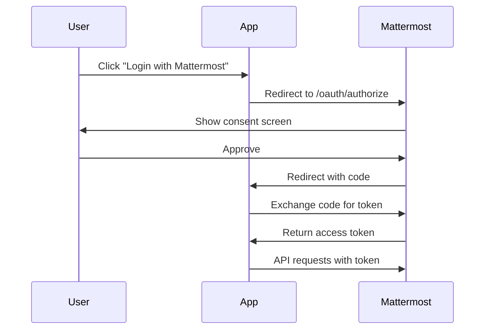

Mattermost supports OAuth 2.0 for allowing external applications to authenticate and authorize access to user accounts. This enables you to build third-party applications, mobile apps, and integrations that use Mattermost as an identity provider.

## OAuth 2.0 Overview

OAuth 2.0 allows applications to:
- Authenticate users without handling passwords
- Request specific permissions (scopes)
- Access Mattermost API on behalf of users
- Provide single sign-on (SSO) experiences

## Supported Grant Types

Mattermost supports the **Authorization Code Grant** flow, which is the most secure and recommended approach for web and mobile applications.

### Authorization Code Flow



## Registering an OAuth 2.0 App

<Steps>
  <Step title="Enable OAuth 2.0">
    Ensure OAuth 2.0 is enabled in **System Console** > **Integrations** > **Integration Management**
  </Step>
  
  <Step title="Navigate to OAuth 2.0 Apps">
    Go to **Main Menu** > **Integrations** > **OAuth 2.0 Applications**
  </Step>
  
  <Step title="Add OAuth App">
    Click **Add OAuth 2.0 Application**
  </Step>
  
  <Step title="Configure application">
    - **Name**: Your application name
    - **Description**: What the app does
    - **Homepage**: Your app's website
    - **Callback URLs**: Redirect URIs (one per line)
    - **Icon URL**: Application icon (optional)
  </Step>
  
  <Step title="Save credentials">
    Save the **Client ID** and **Client Secret** - you'll need these for authentication
  </Step>
</Steps>

<Warning>
  Keep your **Client Secret** secure! Never expose it in client-side code or public repositories.
</Warning>

## Implementing OAuth 2.0

### Step 1: Authorization Request

Redirect users to Mattermost's authorization endpoint:

```
GET https://your-mattermost-server.com/oauth/authorize
```

**Required Parameters:**

<ParamField query="client_id" type="string" required>
  Your application's Client ID
</ParamField>

<ParamField query="redirect_uri" type="string" required>
  Callback URL registered with your OAuth app (must be exact match)
</ParamField>

<ParamField query="response_type" type="string" required>
  Must be `code` for authorization code flow
</ParamField>

<ParamField query="state" type="string" required>
  Random string for CSRF protection (verify this in callback)
</ParamField>

<ParamField query="scope" type="string">
  Space-separated list of requested permissions (optional, currently not enforced)
</ParamField>

**Example:**

```javascript
const clientId = 'your-client-id';
const redirectUri = 'https://your-app.com/oauth/callback';
const state = generateRandomString(); // Store this for verification

const authUrl = `https://your-mattermost-server.com/oauth/authorize?` +
  `client_id=${clientId}&` +
  `redirect_uri=${encodeURIComponent(redirectUri)}&` +
  `response_type=code&` +
  `state=${state}`;

window.location.href = authUrl;
```

### Step 2: Handle Callback

After user authorization, Mattermost redirects to your callback URL:

```
https://your-app.com/oauth/callback?code=abc123&state=xyz789
```

**Callback Parameters:**

<ParamField query="code" type="string">
  Authorization code (valid for 10 minutes)
</ParamField>

<ParamField query="state" type="string">
  State parameter from authorization request (verify this matches)
</ParamField>

**Example Callback Handler:**

<Tabs>
  <Tab title="Node.js (Express)">
    ```javascript
    const express = require('express');
    const axios = require('axios');
    
    app.get('/oauth/callback', async (req, res) => {
      const { code, state } = req.query;
      
      // Verify state parameter
      if (state !== req.session.oauthState) {
        return res.status(403).send('Invalid state parameter');
      }
      
      try {
        // Exchange code for token
        const tokenResponse = await axios.post(
          'https://your-mattermost-server.com/oauth/access_token',
          {
            grant_type: 'authorization_code',
            client_id: process.env.MATTERMOST_CLIENT_ID,
            client_secret: process.env.MATTERMOST_CLIENT_SECRET,
            code: code,
            redirect_uri: 'https://your-app.com/oauth/callback'
          }
        );
        
        const { access_token, token_type, expires_in, refresh_token } = tokenResponse.data;
        
        // Store tokens securely
        req.session.accessToken = access_token;
        req.session.refreshToken = refresh_token;
        
        // Get user info
        const userResponse = await axios.get(
          'https://your-mattermost-server.com/api/v4/users/me',
          {
            headers: {
              'Authorization': `Bearer ${access_token}`
            }
          }
        );
        
        const user = userResponse.data;
        req.session.user = user;
        
        res.redirect('/dashboard');
        
      } catch (error) {
        console.error('OAuth error:', error);
        res.status(500).send('Authentication failed');
      }
    });
    ```
  </Tab>
  
  <Tab title="Python (Flask)">
    ```python
    from flask import Flask, request, redirect, session
    import requests
    
    app = Flask(__name__)
    app.secret_key = 'your-secret-key'
    
    @app.route('/oauth/callback')
    def oauth_callback():
        code = request.args.get('code')
        state = request.args.get('state')
        
        # Verify state parameter
        if state != session.get('oauth_state'):
            return 'Invalid state parameter', 403
        
        # Exchange code for token
        token_response = requests.post(
            'https://your-mattermost-server.com/oauth/access_token',
            data={
                'grant_type': 'authorization_code',
                'client_id': os.getenv('MATTERMOST_CLIENT_ID'),
                'client_secret': os.getenv('MATTERMOST_CLIENT_SECRET'),
                'code': code,
                'redirect_uri': 'https://your-app.com/oauth/callback'
            }
        )
        
        if token_response.status_code != 200:
            return 'Token exchange failed', 500
        
        token_data = token_response.json()
        access_token = token_data['access_token']
        refresh_token = token_data.get('refresh_token')
        
        # Store tokens securely
        session['access_token'] = access_token
        session['refresh_token'] = refresh_token
        
        # Get user info
        user_response = requests.get(
            'https://your-mattermost-server.com/api/v4/users/me',
            headers={'Authorization': f'Bearer {access_token}'}
        )
        
        session['user'] = user_response.json()
        
        return redirect('/dashboard')
    ```
  </Tab>
  
  <Tab title="Go">
    ```go
    package main
    
    import (
        "encoding/json"
        "net/http"
        "net/url"
        "os"
    )
    
    type TokenResponse struct {
        AccessToken  string `json:"access_token"`
        TokenType    string `json:"token_type"`
        ExpiresIn    int    `json:"expires_in"`
        RefreshToken string `json:"refresh_token"`
    }
    
    func oauthCallbackHandler(w http.ResponseWriter, r *http.Request) {
        code := r.URL.Query().Get("code")
        state := r.URL.Query().Get("state")
        
        // Verify state (implement your session logic)
        // if state != session.Get("oauth_state") { ... }
        
        // Exchange code for token
        data := url.Values{}
        data.Set("grant_type", "authorization_code")
        data.Set("client_id", os.Getenv("MATTERMOST_CLIENT_ID"))
        data.Set("client_secret", os.Getenv("MATTERMOST_CLIENT_SECRET"))
        data.Set("code", code)
        data.Set("redirect_uri", "https://your-app.com/oauth/callback")
        
        resp, err := http.PostForm(
            "https://your-mattermost-server.com/oauth/access_token",
            data,
        )
        if err != nil {
            http.Error(w, "Token exchange failed", http.StatusInternalServerError)
            return
        }
        defer resp.Body.Close()
        
        var tokenResp TokenResponse
        if err := json.NewDecoder(resp.Body).Decode(&tokenResp); err != nil {
            http.Error(w, "Failed to parse token", http.StatusInternalServerError)
            return
        }
        
        // Store tokens in session (implement your session logic)
        // session.Set("access_token", tokenResp.AccessToken)
        
        http.Redirect(w, r, "/dashboard", http.StatusFound)
    }
    ```
  </Tab>
</Tabs>

### Step 3: Token Exchange

Exchange the authorization code for an access token:

```
POST https://your-mattermost-server.com/oauth/access_token
```

**Request Parameters:**

<ParamField body="grant_type" type="string" required>
  Must be `authorization_code`
</ParamField>

<ParamField body="client_id" type="string" required>
  Your application's Client ID
</ParamField>

<ParamField body="client_secret" type="string" required>
  Your application's Client Secret
</ParamField>

<ParamField body="code" type="string" required>
  Authorization code from callback
</ParamField>

<ParamField body="redirect_uri" type="string" required>
  Same redirect URI used in authorization request
</ParamField>

**Response:**

```json
{
  "access_token": "xxx-access-token-xxx",
  "token_type": "Bearer",
  "expires_in": 2592000,
  "refresh_token": "xxx-refresh-token-xxx",
  "scope": "user"
}
```

### Step 4: Using Access Tokens

Include the access token in API requests:

```javascript
const response = await axios.get(
  'https://your-mattermost-server.com/api/v4/users/me',
  {
    headers: {
      'Authorization': 'Bearer ' + accessToken
    }
  }
);

const user = response.data;
console.log(`Logged in as: ${user.username}`);
```

### Step 5: Refreshing Tokens

Access tokens expire after 30 days by default. Use the refresh token to obtain a new access token:

```javascript
const tokenResponse = await axios.post(
  'https://your-mattermost-server.com/oauth/access_token',
  {
    grant_type: 'refresh_token',
    client_id: clientId,
    client_secret: clientSecret,
    refresh_token: refreshToken
  }
);

const { access_token, refresh_token } = tokenResponse.data;
// Store new tokens
```

## Security Best Practices

### State Parameter

<Warning>
  Always use and verify the `state` parameter to prevent CSRF attacks
</Warning>

```javascript
// Generate state
const state = crypto.randomBytes(32).toString('hex');
session.oauthState = state;

// Verify in callback
if (req.query.state !== session.oauthState) {
  throw new Error('Invalid state parameter');
}
```

### Token Storage

<Warning>
  Store tokens securely:
  - Server-side sessions (recommended)
  - Encrypted cookies
  - Secure database
  
  Never store tokens in:
  - Local storage
  - Session storage
  - Unencrypted cookies
  - Client-side JavaScript variables
</Warning>

### HTTPS Only

<Warning>
  All OAuth endpoints must use HTTPS in production
</Warning>

### Client Secret Protection

<Tip>
  Never expose client secrets in:
  - Client-side code
  - Mobile apps
  - Public repositories
  - Browser JavaScript
</Tip>

For mobile apps or SPAs, consider using PKCE (Proof Key for Code Exchange) if supported.

## OAuth Providers

Mattermost can also authenticate users via external OAuth providers:

### Supported Providers

- **GitLab** - OAuth 2.0 authentication
- **Google** - OAuth 2.0 authentication
- **Office 365** - OAuth 2.0 authentication
- **OpenID Connect** - Generic OIDC provider

### Configuring OAuth Login

In **System Console** > **Authentication** > **OAuth 2.0**, configure:

1. Select provider (GitLab, Google, Office 365)
2. Enter Client ID and Client Secret from provider
3. Set Discovery Endpoint (for OIDC)
4. Configure user attribute mapping

## Example Applications

### Simple Login Button

```html
<!DOCTYPE html>
<html>
<head>
  <title>Login with Mattermost</title>
</head>
<body>
  <h1>My Application</h1>
  <button onclick="loginWithMattermost()">Login with Mattermost</button>
  
  <script>
    function loginWithMattermost() {
      const clientId = 'your-client-id';
      const redirectUri = 'https://your-app.com/oauth/callback';
      const state = Math.random().toString(36).substring(7);
      
      sessionStorage.setItem('oauth_state', state);
      
      const authUrl = `https://your-mattermost-server.com/oauth/authorize?` +
        `client_id=${clientId}&` +
        `redirect_uri=${encodeURIComponent(redirectUri)}&` +
        `response_type=code&` +
        `state=${state}`;
      
      window.location.href = authUrl;
    }
  </script>
</body>
</html>
```

### Express.js Complete Example

```javascript
const express = require('express');
const session = require('express-session');
const axios = require('axios');
const crypto = require('crypto');

const app = express();

app.use(session({
  secret: 'your-session-secret',
  resave: false,
  saveUninitialized: false,
  cookie: { secure: true, httpOnly: true }
}));

const MATTERMOST_URL = 'https://your-mattermost-server.com';
const CLIENT_ID = process.env.MATTERMOST_CLIENT_ID;
const CLIENT_SECRET = process.env.MATTERMOST_CLIENT_SECRET;
const REDIRECT_URI = 'https://your-app.com/oauth/callback';

// Login route
app.get('/login', (req, res) => {
  const state = crypto.randomBytes(32).toString('hex');
  req.session.oauthState = state;
  
  const authUrl = `${MATTERMOST_URL}/oauth/authorize?` +
    `client_id=${CLIENT_ID}&` +
    `redirect_uri=${encodeURIComponent(REDIRECT_URI)}&` +
    `response_type=code&` +
    `state=${state}`;
  
  res.redirect(authUrl);
});

// Callback route
app.get('/oauth/callback', async (req, res) => {
  const { code, state } = req.query;
  
  if (state !== req.session.oauthState) {
    return res.status(403).send('Invalid state');
  }
  
  try {
    const tokenResponse = await axios.post(
      `${MATTERMOST_URL}/oauth/access_token`,
      {
        grant_type: 'authorization_code',
        client_id: CLIENT_ID,
        client_secret: CLIENT_SECRET,
        code: code,
        redirect_uri: REDIRECT_URI
      }
    );
    
    req.session.accessToken = tokenResponse.data.access_token;
    req.session.refreshToken = tokenResponse.data.refresh_token;
    
    const userResponse = await axios.get(
      `${MATTERMOST_URL}/api/v4/users/me`,
      { headers: { 'Authorization': `Bearer ${req.session.accessToken}` } }
    );
    
    req.session.user = userResponse.data;
    res.redirect('/dashboard');
    
  } catch (error) {
    res.status(500).send('Authentication failed');
  }
});

// Protected route
app.get('/dashboard', (req, res) => {
  if (!req.session.user) {
    return res.redirect('/login');
  }
  res.send(`Welcome ${req.session.user.username}!`);
});

app.listen(3000);
```

## Troubleshooting

<Accordion title="Invalid redirect_uri error">
  - Verify redirect URI exactly matches one registered with OAuth app
  - Check for trailing slashes
  - Ensure protocol (http/https) matches
  - URL encoding must match
</Accordion>

<Accordion title="Invalid client credentials">
  - Verify Client ID and Client Secret are correct
  - Check that OAuth app is not deleted or disabled
  - Ensure you're using the right Mattermost server
</Accordion>

<Accordion title="Token expired error">
  - Implement token refresh logic
  - Check token expiration before API calls
  - Use refresh token to obtain new access token
</Accordion>

## Next Steps

<CardGroup cols={2}>
  <Card title="API Reference" icon="code" href="/api/authentication">
    Learn about API authentication methods
  </Card>
  
  <Card title="User API" icon="users" href="/api/users">
    Work with user data
  </Card>
  
  <Card title="Webhooks" icon="webhook" href="/integrations/webhooks">
    Integrate with webhooks
  </Card>
  
  <Card title="Plugins" icon="puzzle-piece" href="/dev/plugins/overview">
    Build custom plugins
  </Card>
</CardGroup>
