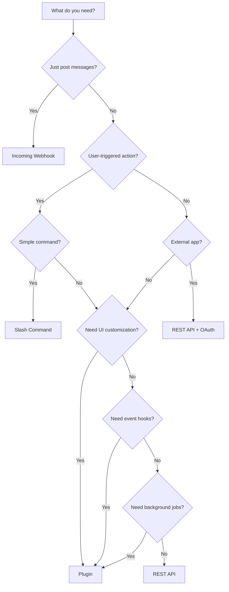

Mattermost offers multiple ways to extend functionality. Understanding when to use plugins versus other integration methods will help you choose the right approach for your use case.

## Integration Methods Comparison

<CardGroup cols={2}>
  <Card title="Webhooks" icon="webhook" href="/integrations/webhooks">
    **Best for:** Simple message posting and basic automation
    
    **Use when:** You need to send/receive messages without complex logic
  </Card>
  
  <Card title="Slash Commands" icon="terminal" href="/integrations/slash-commands">
    **Best for:** User-invoked actions
    
    **Use when:** Users need to trigger specific commands
  </Card>
  
  <Card title="OAuth Apps" icon="key" href="/integrations/oauth">
    **Best for:** Third-party authentication
    
    **Use when:** Building apps that authenticate via Mattermost
  </Card>
  
  <Card title="Plugins" icon="puzzle-piece" href="/dev/plugins/overview">
    **Best for:** Deep integration and custom features
    
    **Use when:** You need full access to Mattermost internals
  </Card>
</CardGroup>

## When to Use Plugins

Choose plugins when you need:

### Server-Side Capabilities

<Check>
  **Event Hooks** - React to messages, user joins, channel creation, etc.
</Check>

<Check>
  **Database Access** - Store and retrieve custom data
</Check>

<Check>
  **Background Jobs** - Run scheduled tasks and async operations
</Check>

<Check>
  **API Extensions** - Add custom API endpoints
</Check>

<Check>
  **WebSocket Events** - Send real-time updates to clients
</Check>

### Client-Side Capabilities

<Check>
  **UI Customization** - Add buttons, menus, and custom components
</Check>

<Check>
  **Custom Post Types** - Create specialized message formats
</Check>

<Check>
  **Right-Hand Sidebar** - Add custom panels and views
</Check>

<Check>
  **Redux Integration** - Access and modify application state
</Check>

<Check>
  **Custom Routes** - Add new pages and views
</Check>

### Advanced Features

<Check>
  **Configuration UI** - Settings page in System Console
</Check>

<Check>
  **Multi-tenancy** - Different config per team/channel
</Check>

<Check>
  **Performance** - Direct access to Mattermost internals
</Check>

<Check>
  **Security** - Server-side validation and secrets management
</Check>

## When NOT to Use Plugins

### Simple Notifications

<Warning>
  If you only need to post messages to channels, use **incoming webhooks** instead
</Warning>

**Example:** CI/CD notifications, monitoring alerts, RSS feeds

**Why webhooks are better:**
- Simpler to set up (just a URL)
- No deployment required
- No server resources needed
- Easier to maintain

### Basic Commands

<Warning>
  For simple user commands, use **slash commands** instead
</Warning>

**Example:** `/weather Seattle`, `/poll "What's for lunch?"`

**Why slash commands are better:**
- Easier to develop
- External hosting
- Language-agnostic
- Quick iteration

### External Apps

<Warning>
  For standalone applications, use the **REST API** with **OAuth** instead
</Warning>

**Example:** Mobile apps, desktop tools, web dashboards

**Why API + OAuth is better:**
- No Mattermost server dependency
- Independent deployment
- Language flexibility
- Standard auth patterns

## Decision Tree



## Feature Comparison Matrix

| Feature | Webhooks | Slash Commands | OAuth Apps | Plugins |
|---------|----------|----------------|------------|---------|
| **Post Messages** | ✅ | ✅ | ✅ | ✅ |
| **Receive Messages** | ✅ (outgoing) | ❌ | ✅ | ✅ |
| **Event Hooks** | Limited | ❌ | ❌ | ✅ |
| **UI Customization** | ❌ | ❌ | ❌ | ✅ |
| **Data Storage** | External | External | External | Built-in |
| **Background Jobs** | ❌ | ❌ | ❌ | ✅ |
| **Custom Endpoints** | ❌ | ❌ | ✅ | ✅ |
| **Configuration UI** | ❌ | ❌ | ❌ | ✅ |
| **Setup Complexity** | Low | Low | Medium | High |
| **Maintenance** | Low | Low | Medium | High |
| **Performance** | Good | Good | Good | Excellent |
| **Deployment** | External | External | External | Server |

## Real-World Examples

### Use Webhooks

<Accordion title="CI/CD Notifications">
  **Scenario:** Send build status from Jenkins to Mattermost
  
  **Why webhook:** Simple one-way notification, no complex logic needed
  
  ```bash
  curl -X POST https://mm.example.com/hooks/xxx \
    -d '{"text": "Build #123 succeeded!"}'
  ```
</Accordion>

<Accordion title="Monitoring Alerts">
  **Scenario:** Post alerts from Prometheus to channels
  
  **Why webhook:** Fire-and-forget alerts, formatted messages
  
  Configure Prometheus Alertmanager webhook receiver
</Accordion>

### Use Slash Commands

<Accordion title="GIPHY Integration">
  **Scenario:** `/giphy search cats` posts animated GIF
  
  **Why slash command:** User-triggered, returns formatted response
  
  External service queries GIPHY API and returns image
</Accordion>

<Accordion title="Poll Creation">
  **Scenario:** `/poll "Question?" "Option 1" "Option 2"`
  
  **Why slash command:** Simple command parser, interactive response
  
  Could be upgraded to plugin for vote tracking and UI
</Accordion>

### Use Plugins

<Accordion title="Video Conferencing (Calls Plugin)">
  **Scenario:** Start voice/video calls directly in Mattermost
  
  **Why plugin:**
  - UI integration (call button in channel header)
  - WebRTC connection management
  - Real-time participant list
  - Custom post types for call notifications
  - Server-side WebSocket broadcasting
  
  Cannot be done with webhooks or commands
</Accordion>

<Accordion title="Jira Integration">
  **Scenario:** Create/update Jira issues from Mattermost
  
  **Why plugin:**
  - Interactive issue creation dialog
  - Real-time issue updates via webhooks
  - Custom post rendering for Jira issues
  - Autocomplete for issue keys
  - Per-channel Jira project mapping
  
  Could start as webhook but plugin provides better UX
</Accordion>

<Accordion title="GitHub Integration">
  **Scenario:** GitHub notifications and actions
  
  **Why plugin:**
  - Subscribe to repo notifications
  - PR/Issue creation from Mattermost
  - Unfurl GitHub links with rich previews
  - Slash commands for GitHub actions
  - OAuth authentication with GitHub
  
  Combines multiple integration types in one package
</Accordion>

## Migration Path

### Start Simple, Scale Up

Many successful integrations follow this progression:

<Steps>
  <Step title="Proof of Concept">
    Start with incoming webhook to validate the use case
    
    **Time:** Hours
    **Complexity:** Low
  </Step>
  
  <Step title="Add Interactivity">
    Add slash commands for user-triggered actions
    
    **Time:** Days
    **Complexity:** Low-Medium
  </Step>
  
  <Step title="Enhanced Experience">
    Migrate to plugin for UI integration and advanced features
    
    **Time:** Weeks
    **Complexity:** High
  </Step>
</Steps>

### Example: Incident Management

**Phase 1: Webhook**
```bash
# PagerDuty sends incident alerts
curl -X POST $WEBHOOK_URL -d '{
  "text": "Incident: Database down"
}'
```

**Phase 2: Slash Command**
```
# Users can create incidents
/incident create "Database connection timeout"
```

**Phase 3: Plugin**
```
- UI: Incident panel in right-hand sidebar
- Custom post type: Rich incident cards
- Event hooks: Auto-create channel for incident
- Background jobs: Sync with PagerDuty
- Dialog: Guided incident creation form
```

## Cost-Benefit Analysis

### Webhooks

**Costs:**
- Limited functionality
- One-way communication (mostly)
- No UI integration

**Benefits:**
- Quick to implement (hours)
- Low maintenance
- Easy to debug
- External hosting

**ROI:** High for simple notifications

### Slash Commands

**Costs:**
- Manual user invocation
- External hosting needed
- 3-second response limit

**Benefits:**
- User-friendly interface
- Language-agnostic
- Quick development
- Easy testing

**ROI:** High for simple commands

### Plugins

**Costs:**
- Complex development (weeks)
- Go/React knowledge required
- Server deployment needed
- More maintenance burden

**Benefits:**
- Full Mattermost integration
- Rich user experience
- High performance
- Professional appearance

**ROI:** High for complex features

## Combining Approaches

You can use multiple integration methods together:

### Plugin + Webhooks

```go
// Plugin receives webhooks from external service
func (p *Plugin) ServeHTTP(c *plugin.Context, w http.ResponseWriter, r *http.Request) {
    if r.URL.Path == "/webhook" {
        // Process webhook
        payload := parseWebhook(r.Body)
        
        // Use plugin API to post
        p.API.CreatePost(&model.Post{
            ChannelId: channelID,
            Message:   payload.Message,
        })
    }
}
```

### Plugin + Slash Commands

```go
// Register slash command in plugin
func (p *Plugin) OnActivate() error {
    return p.API.RegisterCommand(&model.Command{
        Trigger:          "mycommand",
        AutoComplete:     true,
        AutoCompleteDesc: "My custom command",
    })
}

func (p *Plugin) ExecuteCommand(c *plugin.Context, args *model.CommandArgs) (*model.CommandResponse, *model.AppError) {
    // Handle command with full plugin capabilities
}
```

## Next Steps

<CardGroup cols={2}>
  <Card title="Start with Webhooks" icon="webhook" href="/integrations/webhooks">
    Begin with the simplest integration
  </Card>
  
  <Card title="Build a Plugin" icon="puzzle-piece" href="/dev/plugins/quickstart">
    Create your first Mattermost plugin
  </Card>
  
  <Card title="Integration Examples" icon="github" href="https://github.com/mattermost">
    Browse open source integrations
  </Card>
  
  <Card title="Plugin Marketplace" icon="store" href="https://mattermost.com/marketplace/">
    Explore existing plugins
  </Card>
</CardGroup>
